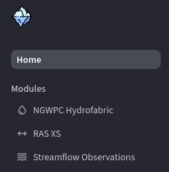

# Updating or Extending the Dashboard

This section describes how developers and contributors can update dashboard content or add new features.

## Project Layout

The dashboard lives under `app/streamlit`. Pages exist as separate `.py` files within that directory. There's a central entrypoint file (`streamlit.py` in this case) that acts like a router or frame of common elements around each of the pages.

The dashboard has multiple pages, and the layout is defined within the entrypoint file, using the `st.navigation` function. `st.navigation` displays the available pages in the sidebar if there is more than one page. Example:

```python
modules = {
    "": [st.Page("home.py", title="Home")],
    "Modules": [
        st.Page("hydrofabric_dash.py", title="NGWPC Hydrofabric", icon=":material/water_drop:"),
        st.Page("ras_xs_dash.py", title="RAS XS", icon=":material/arrow_range:"),
        st.Page("sf_obsv_dash.py", title="Streamflow Observations", icon=":material/waves:"),
    ],
}
pg = st.navigation(modules)
pg.run()
```

Here, the `modules` dictionary creates sections within the navigation menu. There's a blank top-level section for the `home.py` page, and a 'Modules' section housing the dashboard pages (`hydrofabric_dash.py`, `ras_xs_dash.py` and `sf_obsv_dash.py`) How it ends up looking:



## Modifying Existing Pages

To change existing pages, simply edit the corresponding `.py` file ('RAS XS' page: `ras_xs_dash.py`, etc.) The `modules` dictionary in the entrypoint file (`streamlit.py`) defines this, so use that to inform where to make changes.

For a comprehensive overview on Streamlit, the [official documentation](https://docs.streamlit.io/get-started/fundamentals/main-concepts) is a great place to begin.

## Adding New Pages

To add a new page to the dashboard, create a new `.py` file under `app/streamlit`. After this new page is made, add the page to the `modules` dictionary in the entrypoint file. For example, adding a hypothetical topobathy page to the dashboard would involve a new file named `topobathy_dash.py`, then updating the `modules` dictionary by adding a new `st.Page` declaration:

```python
st.Page("topobathy_dash.py", title="Topobathy")
```

The updated modules dictionary would look like:

```python
modules = {
    "": [st.Page("home.py", title="Home")],
    "Modules": [
        st.Page("hydrofabric_dash.py", title="NGWPC Hydrofabric", icon=":material/water_drop:"),
        st.Page("ras_xs_dash.py", title="RAS XS", icon=":material/arrow_range:"),
        st.Page("sf_obsv_dash.py", title="Streamflow Observations", icon=":material/waves:"),
        st.Page("topobathy_dash.py", title="Topobathy"),
    ],
}
```

## Configuration File

The dashboard's configuration is handled currently with a [TOML](https://toml.io/en/) file. The configuration is defined locally, per-project, using the `app/streamlit/.streamlit/config.toml` file. All available configuration options are documented [here](https://docs.streamlit.io/develop/api-reference/configuration/config.toml).

Streamlit provides three other ways to set configuration options as well:
- Flags on the command line when running `streamlit run`
- `STREAMLIT_*` environment variables
- A global config file at `~/.streamlit/config.toml`

A general overview on configuring Streamlit can be found [here](https://docs.streamlit.io/develop/concepts/configuration/options).

## Testing Changes Locally

Testing Streamlit applications is very easy. Changes can be seen immediately, even when altering files while the app is running; Streamlit automatically reloads on file save.
