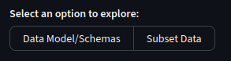
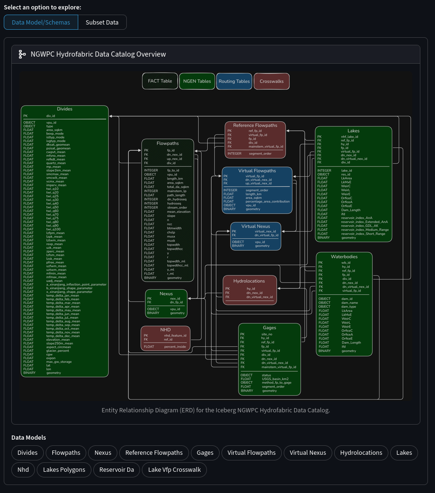
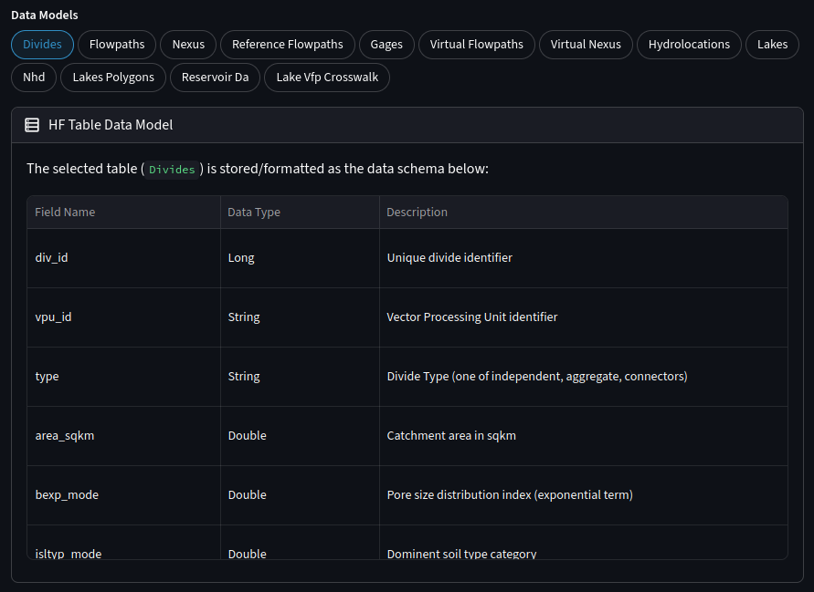
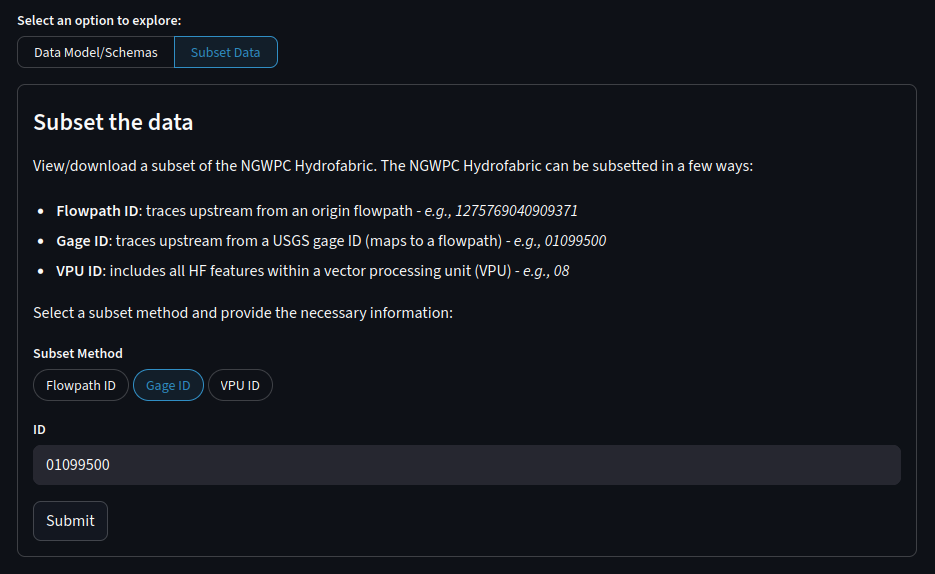
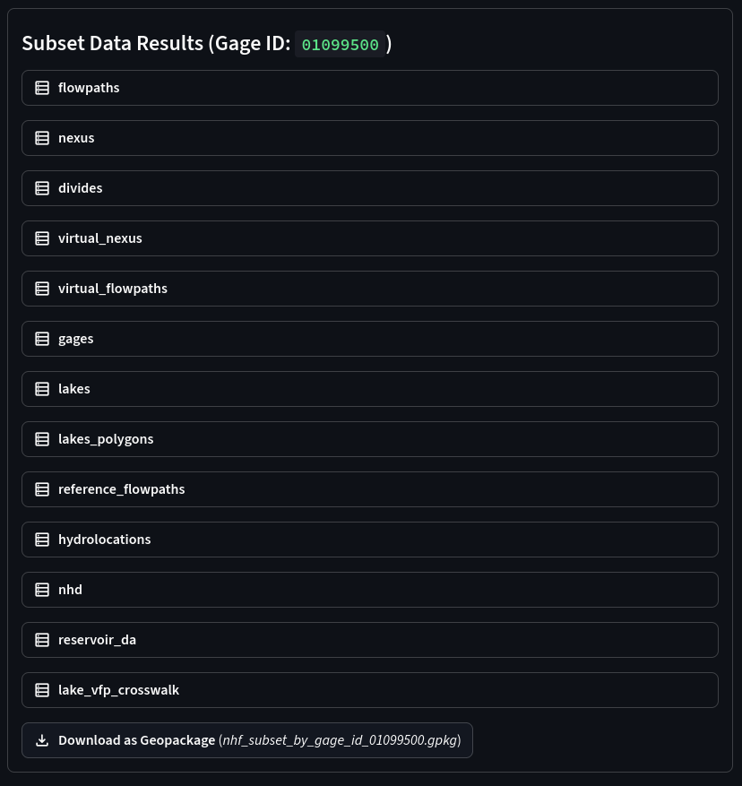
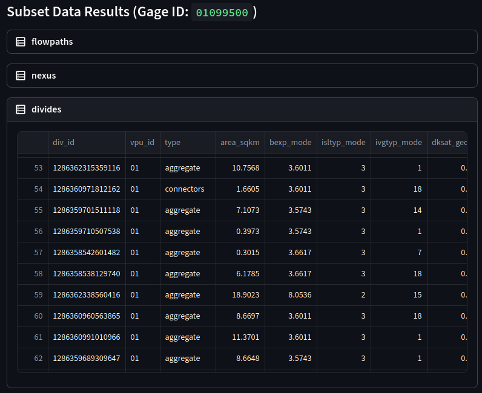
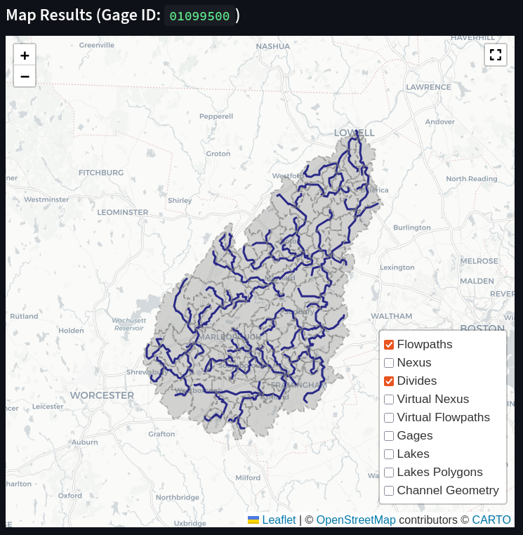
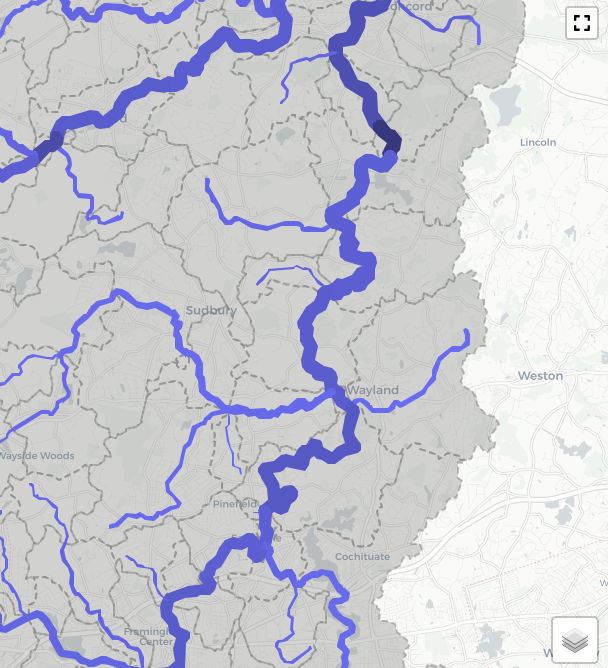
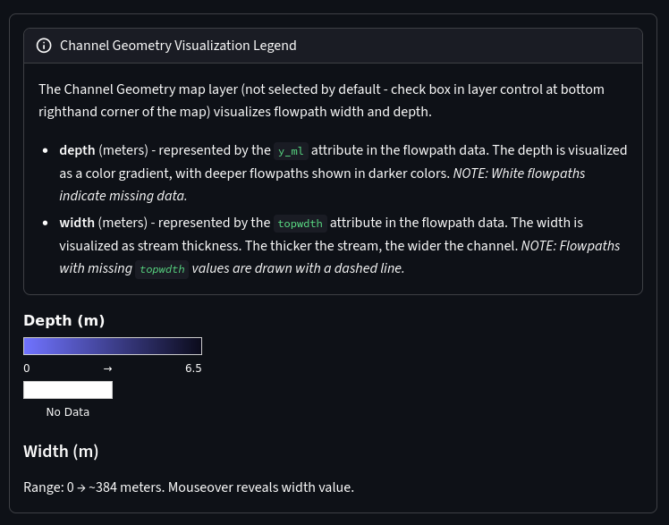

# NGWPC Hydrofabric Page

The 'NGWPC Hydrofabric' page allows users to explore the core hydrologic network components as a part of the NGWPC Hydrofabric.

## Features

- Browse schema-level descriptions of each dataset
- Select a flowpath ID, USGS gage ID, or VPU ID to create a hydrologic network subset
- Trace upstream automatically from the chosen origin
- View the resulting subset both tabularly and on an interactive map
- Download the subset as a GeoPackage

## Schema Displays

Upon loading the page, the user is given a choice between exploring the data model/schemas for the NGWPC Hydrofabric, or performing a stream-traversal subset of the Hydrofabric.

### Catalog ERD

Selecting the first option (data models/schemas) will open an entity relationship diagram (ERD) for display to the user. This ERD represents the latest Icefabric catalog, containing the NGWPC Hydrofabric.

### Individual Schemas

Below this, the user can select individual data models from within the catalog. Upon selection, the corresponding data schema will be shown in tabular format. Each field is given a field name, data type and description.

## Subsetting

If the user instead wants to subset the Hydrofabric, they can select that option from the top instead.

### Subsetting Concepts

Subsetting begins with a user-provided identifier:

- **Flowpath ID:** The dashboard traces upstream along the river network.
- **USGS Gage ID:** The dashboard identifies the flowpath associated with the gage and performs the same upstream trace.
- **VPU ID:** The dashboard filters all data contained within a specified VPU grouping.

The Hydrofabric will then be subset according to the ID provided. If a flowpath ID or USGS gage ID is given, an upstream trace is performed to grab all hydrologic data along the way. A VPU ID will simply filter for that specific VPU ID and return all the matches (VPUs are massive and will return a very large subset).

### Dataframe Results

A collection of tabular Streamlit dataframes will be displayed after the backend logic is complete. All NGWPC Hydrofabric components are included. Among the tabular data:

- Flowpaths
- Nexuses
- Divides
- Lakes, Lake Polygons & Hydrolocations
- Virtual Flowpaths/Nexuses
- Gages
- Reference Flowpaths
- Miscellaneous other datasets (NHD, Reservoir DA, Lake VFP Crosswalk, etc.)
- Possibly additional datasets as the Hydrofabric is updated in the future

Individual datasets can be expanded and perused at the user's discretion as well.

#### Downloading Results

A “Download as GeoPackage” button appears below the data, allowing users to download the dataframe as a GeoPackage file.

### Map Visualization

Also, the dashboard will generate an interactive map to view the subset.

The interactive Leaflet map displays all NGWPC Hydrofabric components (only whose data includes geometry information):

- Flowpath/Virtual Flowpath lines
- Divide polygons
- Nexus/Virtual Nexus points
- Gage points
- Lake points
- Lake polygons

You can zoom, pan, and inspect features. Each layer can be toggled for clarity. To toggle layer visibility, click the layer control button in the bottom right corner of the map viewport, then select specific layers to toggle on/off.

#### Channel Geometries

You also have the option to view the flowpaths in an enhanced way, using the 'Channel Geometries' layer. This layer is toggled off by default.

The flowpaths are shown with variable thickness and colors. The thicker the line, the wider the channel is. The color is on a gradient from light to dark blue, where the darker the line is, the deeper the channel is.

Below the map window is a legend explaning the channel geometries layer, as well as giving ranges to the channel widths/depths.

