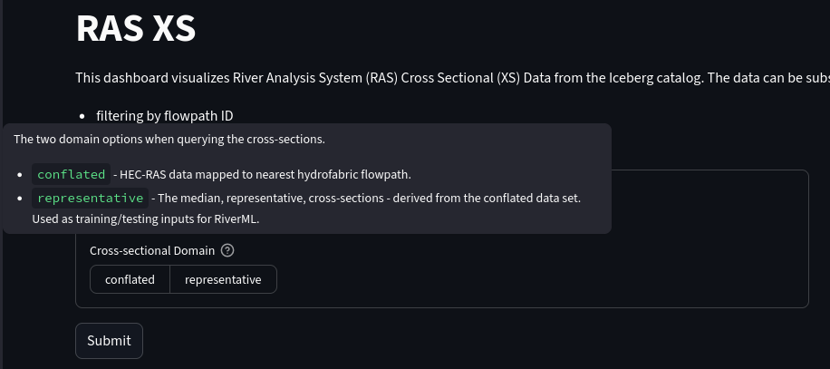
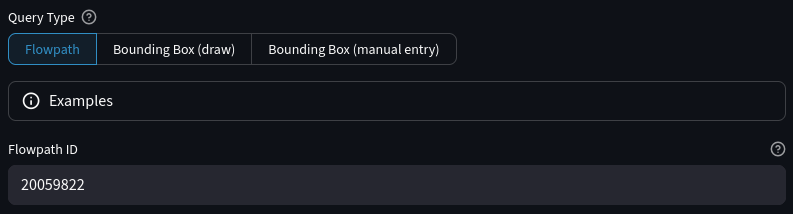
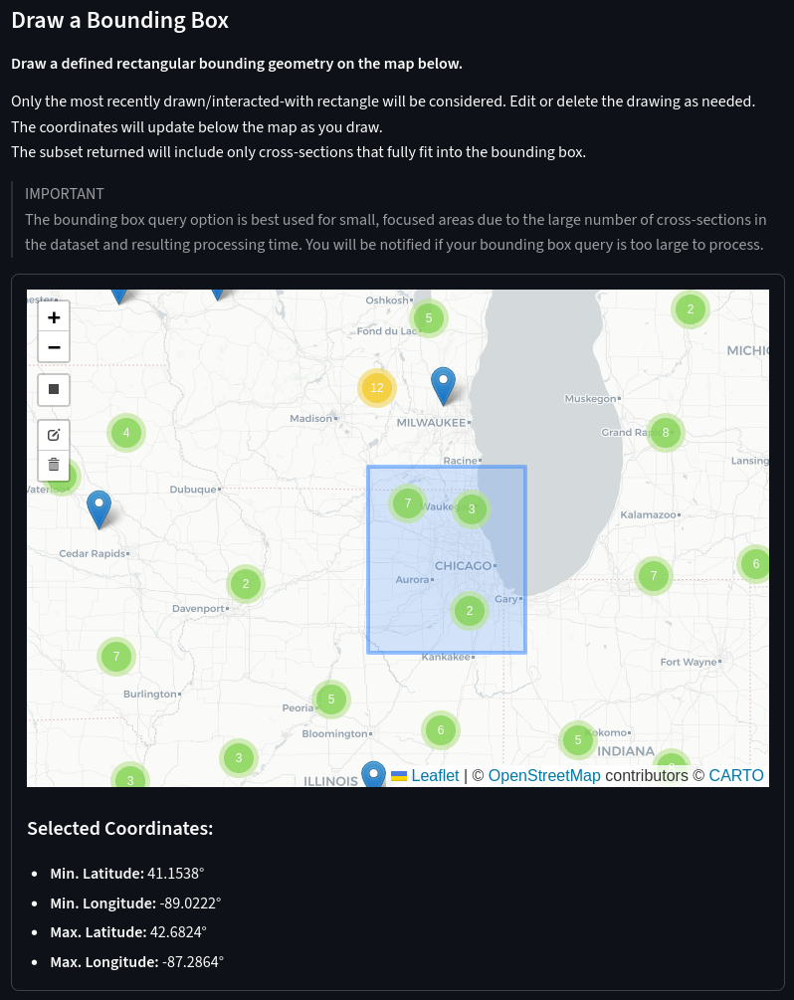
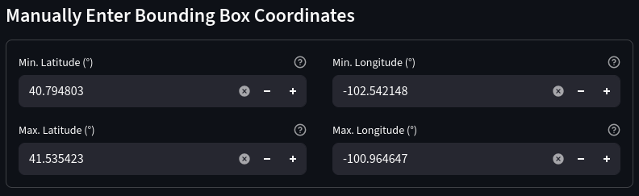
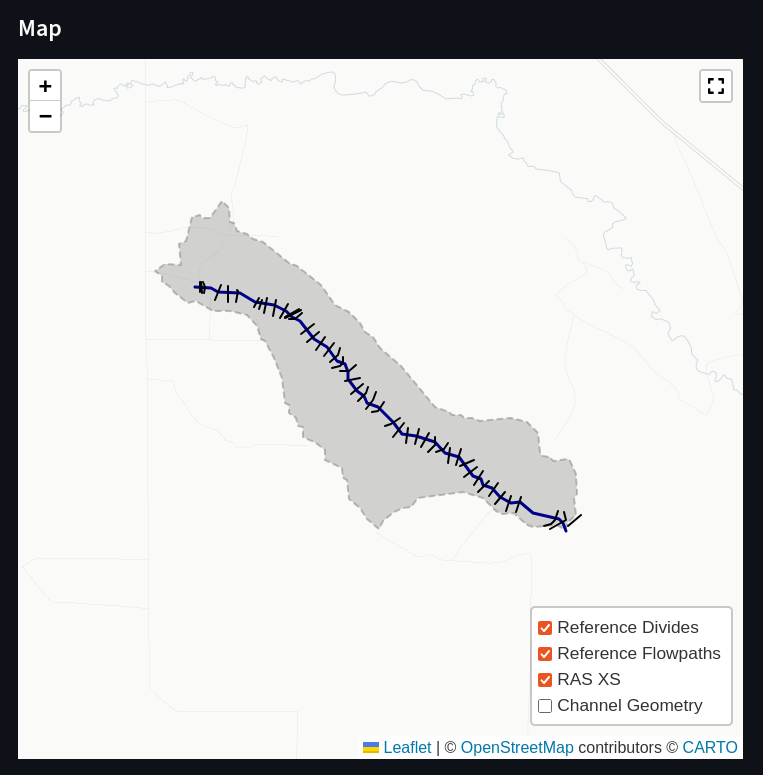
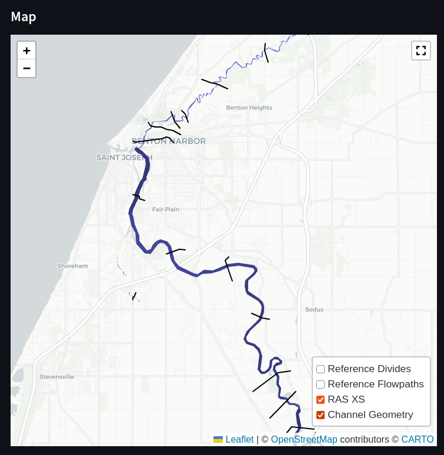
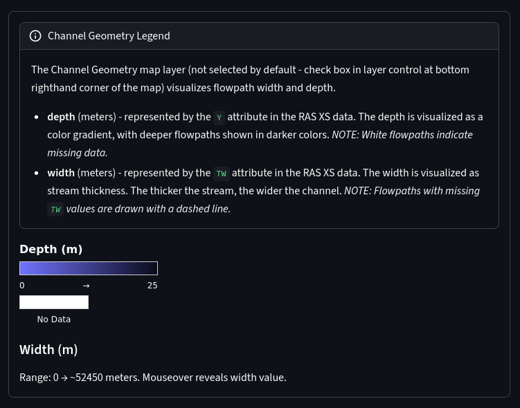
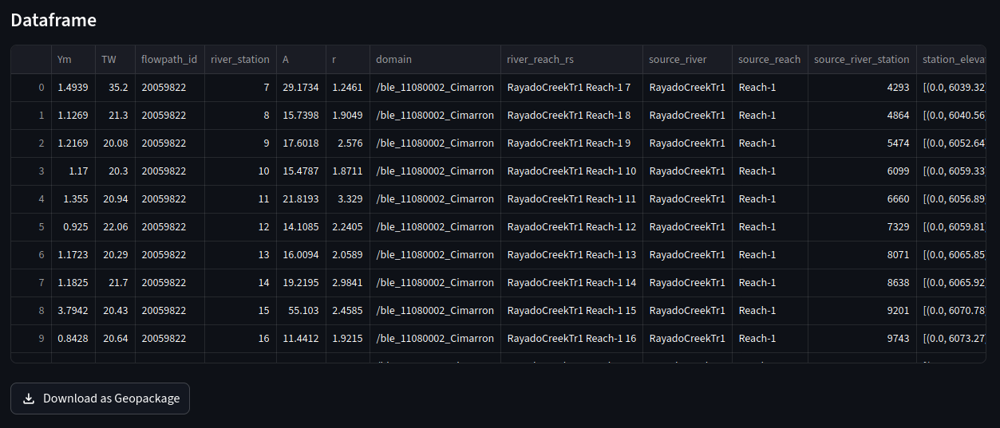

# RAS XS Page

The 'RAS XS' page provides tools for exploring River Analysis System (RAS) cross-sectional data stored in the Iceberg catalog.

## Features

- View cross-sectional datasets alongside associated flowpaths and divides
- Subset data using:
    - A single flowpath ID
    - A user-drawn geographic bounding box on the Leaflet map
- View results tabularly and geospatially
- Download the subset as a GeoPackage

## Domain Options

You begin by deciding which cross-sectional data domain to pull from. The RAS XS dataset is formatted in two ways:

- **Conflated** — This is the full collection of HEC-RAS data. Each cross-sectional value is mapped to the nearest hydrofabric flowpath. Thus, most flowpaths will have many cross-sectional values along the lengths of their geometries.
- **Representative** — This is derived from the conflated dataset; each value is the median, representative, cross-section of a specific hydrofabric flowpath. So, each flowpath will have one associated representative cross-sectional value. In particular, this dataset is used as training/testing inputs for [RiverML](https://github.com/NOAA-OWP/predict-riverML).

The conflated domain is much larger, and more computationally complex to query.

## Subsetting Options

Next, you choose a subsetting method:

### Option 1 — Flowpath ID

The dashboard retrieves all XS features associated with the a single selected flowpath.

### Option 2 — Bounding Box

Use an interactive leaflet map to draw a bounding box.
All XS features intersecting the box are included.
The dashboard will show the selected min/max lat/lon coordinates after you draw an appropriate boundary box. The dashboard will warn you if your drawn box is too large (overly large boxes will lead to massive slowdown.)

### Option 3 — Bounding Box (manual)

Enter the bounding box manually, by supplying min/max lat/lon coordinates (four in total)

## Map Visualization

The dashboard will fetch the data requested and generate a map to view the cross-sections.

The map displays the following as layers:

- Flowpaths
- Divides
- Cross-Sectional Lines
- Channel Geometry

You can zoom, pan, and inspect features. Each layer can be toggled for clarity. To toggle layer visibility, click the layer control button in the bottom right corner of the map viewport, then select specific layers to toggle on/off.

### Channel Geometries

As with the 'NGWPC Hydrofabric' page, you also have the option to view the flowpaths in an enhanced way, using the 'Channel Geometries' layer. This layer is toggled off by default.

The flowpaths are shown with variable thickness and colors. The thicker the line, the wider the channel is. The color is on a gradient from light to dark blue, where the darker the line is, the deeper the channel is.

Below the map window is a legend explaning the channel geometries layer, as well as giving ranges to the channel widths/depths.

## Tabulated Dataset

Below the map, the dashboard will provide a tabulation of the cross-sectional data, not including the flowpath and divide data. Further, a “Download as GeoPackage” button appears below the data, allowing users to download the dataframe as a GeoPackage file.

