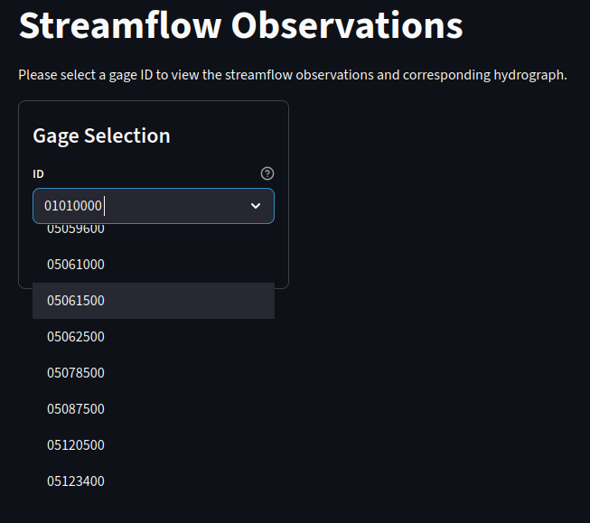
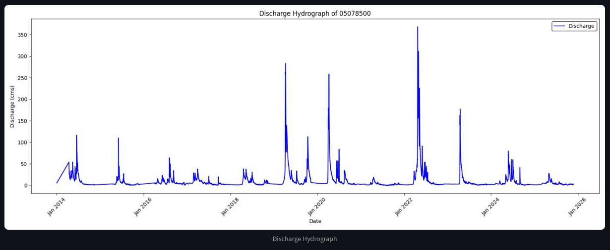
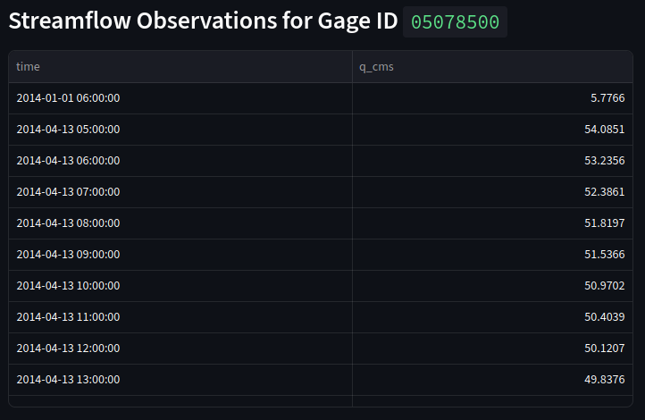
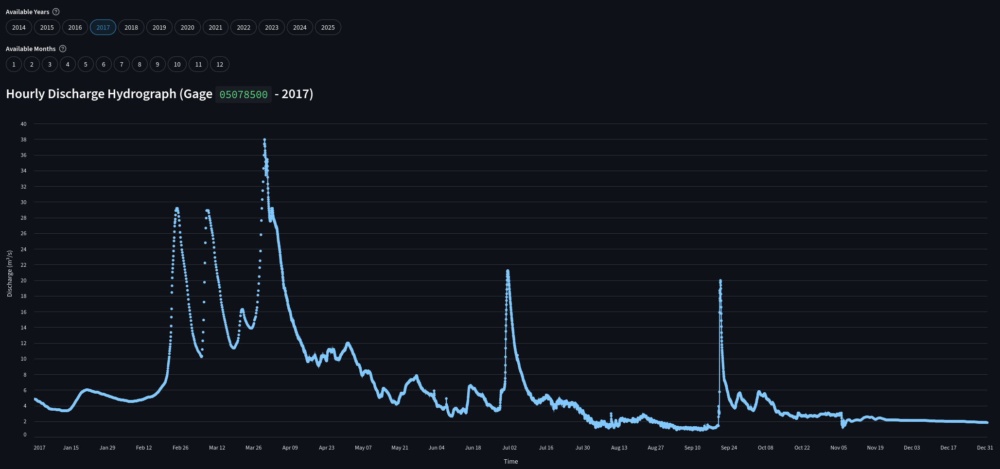
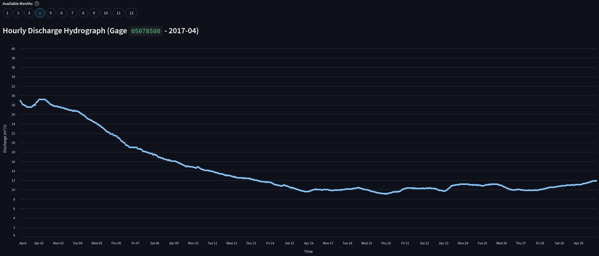
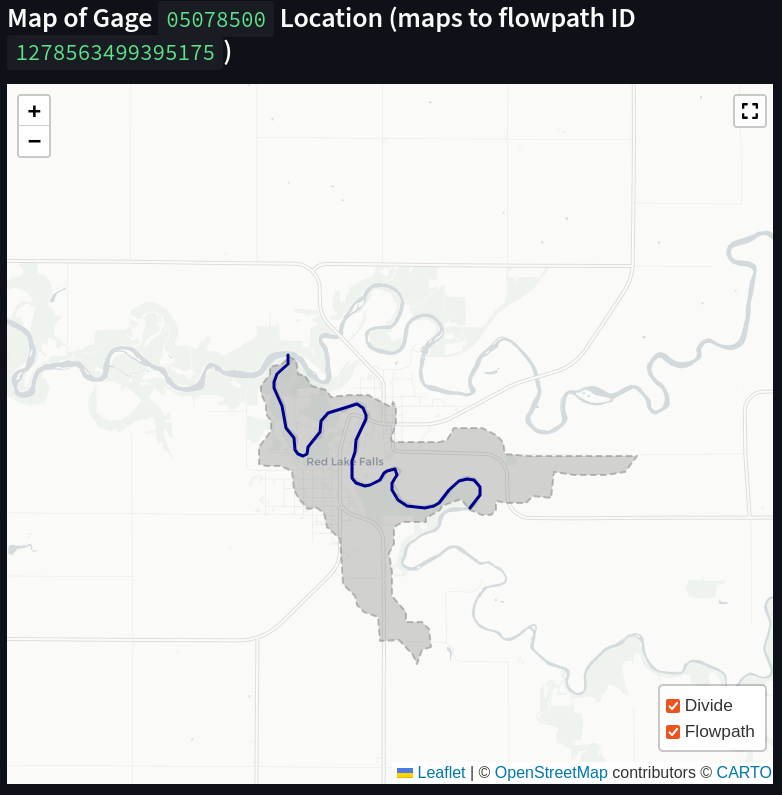

# Streamflow Observations Page

The 'Streamflow Observations' page allows users to explore hourly streamflow records from USGS gages.

## Features

For each USGS gage with streamflow data:

- Retrieve hourly discharge time series (q_cms)
- View a static full-range hydrograph of the gage
- Interactively explore selected years and months using a zoom/pan hydrograph
- View a map of the gage location and its corresponding flowpath/divide

## Gage Selection

Upon loading the page, the user is given a drop-down box containing hundreds of gage IDs from which to select an ID.

After the ID is entered and submitted, the dashboard loads the streamflow dataset from the Iceberg catalog.

## Full Results

The first of two hydrographs is displayed, alongside the corresponding streamflow data in tabular form (as a Streamlit dataframe). The hydrograph spans the full-and-complete range of data, and is a static image.

The dataframe has a q_cms per-hour format, with each hour having a streamflow value.

## Interactive Hydrograph

Below the top level results, a set of user controls is present; the user can select a year from the time range of the gage's data. After a year is selected, below the controls, an interactive hydrograph will appear, showing the data from that selected year.

The hydrograph can be panned, zoomed, and the individual data points can be highlighted. Further, the user can also select a month in the selected year to get even further granular detail. The hydrograph will update as selections are made by the user.

## Map Visualization

Finally, below the interactive hydrograph, there's a section for geospatial visualization. If the selected USGS gage maps to an NGWPC Hydrofabric flowpath, that flowpath and its corresponding divide will be loaded into a leaflet map. The user can zoom/pan the map as desired.

Both layers (flowpath and divide) can be toggled for clarity. To toggle layer visibility, click the layer control button in the bottom right corner of the map viewport, then select any layer to toggle on/off.
